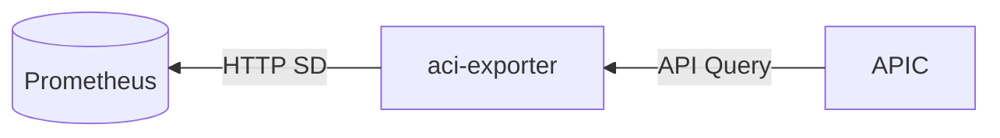
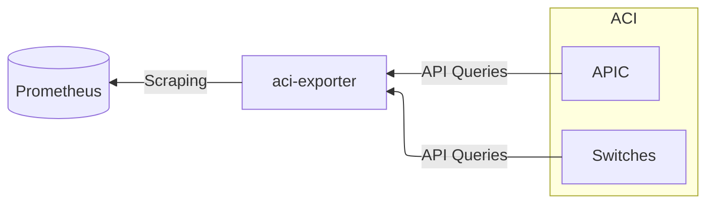
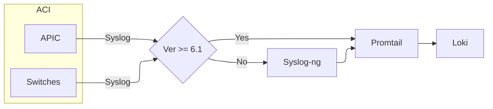
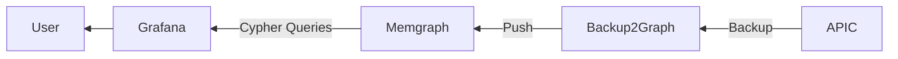
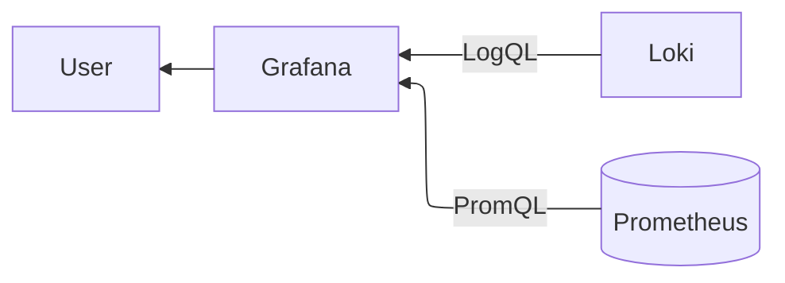
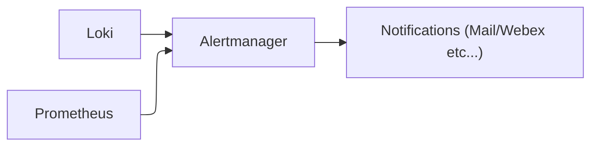

aci-monitoring-stack - Open Source Monitoring for Cisco ACI
------------

# Overview

Harness the power of open source to efficiently monitor your Cisco ACI environment with the ACI-Monitoring-Stack. This lightweight, yet robust, monitoring solution combines top-tier open source tools, each contributing unique capabilities to ensure comprehensive visibility into your ACI infrastructure.

The ACI-Monitoring-Stack integrates the following key components:

- [Grafana](https://grafana.com/oss/grafana/): The leading open-source analytics and visualization platform. Grafana allows you to create dynamic dashboards that provide real-time insights into your network's performance, health, and metrics. With its user-friendly interface, you can easily visualize and correlate data across your ACI fabric, enabling quicker diagnostics and informed decision-making.

- [Prometheus](https://prometheus.io/): A powerful open-source monitoring and alerting toolkit. Prometheus excels in collecting and storing metrics in a time-series database, allowing for flexible queries and real-time alerting. Its seamless integration with Grafana ensures that your monitoring stack provides a detailed and up-to-date view of your ACI environment.

- [Loki](https://grafana.com/oss/loki/): Designed for efficiently aggregating and querying logs from your entire ACI ecosystem. Loki complements Prometheus by focusing on log aggregation, providing a unified stack for metrics and logs. Its integration with Grafana enables you to correlate log data with metrics and create a holistic monitoring experience.

- [Promtail](https://grafana.com/docs/loki/latest/send-data/promtail/): the agent responsible for gathering and shipping the log files to the Loki server.

- [Syslog-ng](https://github.com/syslog-ng/syslog-ng): is an open-source implementation of the Syslog protocol, its role in this stack is to translate syslog messages from RFC 3164 to 5424. This is needed because Promtail only support Syslog RFC 5424 over TCP and this capability is only available in ACI 6.1 and above.

- [aci-exporter](https://github.com/opsdis/aci-exporter): A Prometheus exporter that serves as the bridge between your Cisco ACI environment and the Prometheus monitoring ecosystem. The aci-exporter translates ACI-specific metrics into a format that Prometheus can ingest, ensuring that all crucial data points are captured and monitored effectively.

- [backup2graph](apps/backup2graph/README.md): Convert an ACI Backup into a Graph Database

- [Memgraph](https://github.com/memgraph/memgraph): An open source graph database implemented in C/C++ and leverages an in-memory first architecture. This will be used in the ACI-Monitoring-Stack to explore the ACI configurations imported by backup2graph

- Pre-configured ACI data collections queries, alerts, and dashboards (Work In Progress): The ACI-Monitoring-Stack provides a solid foundation for monitoring an ACI fabric with its pre-defined queries, dashboards, and alerts. While these tools are crafted based on best practices to offer immediate insights into network performance, they are not exhaustive. The strength of the ACI-Monitoring-Stack lies in its community-driven approach. Users are invited to contribute their expertise by providing feedback, sharing custom solutions, and helping enhance the stack. Your input helps to refine and expand the stack's capabilities, ensuring it remains a relevant and powerful tool for network monitoring.

# Your Stack

To gain a comprehensive understanding of the ACI Monitoring Stack and its components it is helpful to break down the stack into separate functions. Each function focuses on a different aspect of monitoring the Cisco Application Centric Infrastructure (ACI) environment.

## Fabric Discovery:

The ACI monitoring stack uses Prometheus Service Discovery (HTTP SD) to dynamically discover and scrape targets by periodically querying a specified HTTP endpoint for a list of target configurations in JSON format.

The ACI Monitoring Stack needs only the IP addresses of the APICs, the Switches will be Auto Discovered. If switches are added or removed from the fabric no action is required from the end user.

## ACI Object Scraping: 

`Prometheus` scraping is the process by which `Prometheus` periodically collects metrics data by sending HTTP requests to predefined endpoints on monitored targets. The `aci-exporter` translates ACI-specific metrics into a format that `Prometheus` can ingest, ensuring that all crucial data points are captured and monitored effectively.

## Syslog Ingestion:

The syslog config is composed of 3 components: `promtail`, `loki` and `syslog-ng`.
Prior to ACI 6.1 `syslog-ng` is required between `ACI` and `Promtail` to convert from RFC 3164 to 5424 syslog message format.

## Config Explorer:

ACI-Monitoring-Stack will generate a Config Snapshot every 15min (By default) and automatically load it into Memgraph.
Backup2Graph uses ACI API Call to:
- Create a new snapshot policy
- Trigger a snapshot
- Delete the snapshot policy and snapshot (once transferred out of the APIC)

and then uses `scp` to copy it over for processing. Once the Snapshot is copied the APIC config is cleaned up

## Data Visualization

The Data Visualization is handled by `Grafana`, an open-source analytics and monitoring platform that allows users to visualize, query, and analyze data from various sources through customizable and interactive dashboards. It supports a wide range of data sources, including `Prometheus` and `Loki` enabling users to create real-time visualizations, alerts, and reports to monitor system performance and gain actionable insights.

## Alerting

`Alertmanager` is a component of the `Prometheus` ecosystem designed to handle alerts generated by `Prometheus`. It manages the entire lifecycle of alerts, including deduplication, grouping, silencing, and routing notifications to various communication channels like email, `Webex`, `Slack`, and others, ensuring that alerts are delivered to the right people in a timely and organized manner.

In the ACI Monitoring Stack both `Prometheus` and `Loki` are configured with alerting rules.

# [Demo Environment Access and Use](docs/demo-environment.md)

# [Stack Deployment Guide](docs/deployment.md)

# [Stack Development Guide](docs/development.md)
