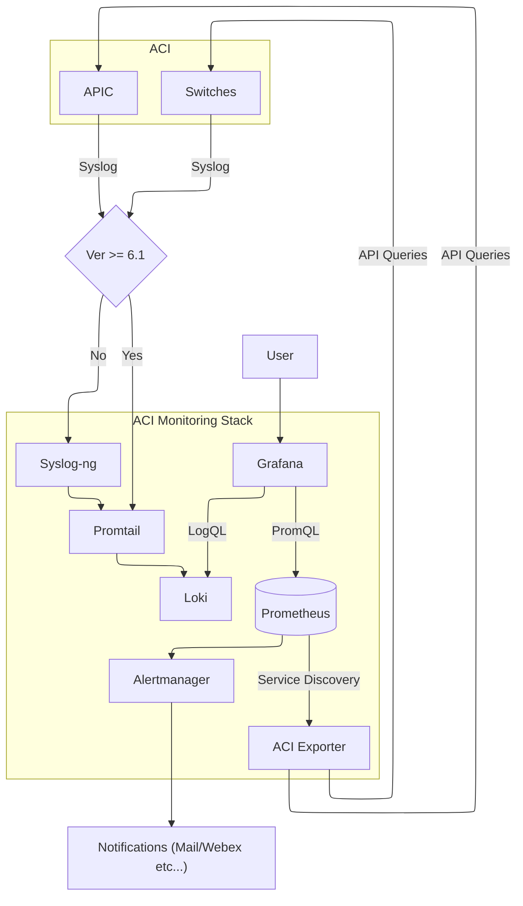

aci-monitoring-stack - Open Source Monitoring for Cisco ACI
------------

# Overview

Harness the power of open source to efficiently monitor your Cisco ACI environment with the ACI-Monitoring-Stack. This lightweight, yet robust, monitoring solution combines top-tier open source tools, each contributing unique capabilities to ensure comprehensive visibility into your ACI infrastructure.

The ACI-Monitoring-Stack integrates the following key components:

- Grafana: The leading open-source analytics and visualization platform. Grafana allows you to create dynamic dashboards that provide real-time insights into your network's performance, health, and metrics. With its user-friendly interface, you can easily visualize and correlate data across your ACI fabric, enabling quicker diagnostics and informed decision-making.

- Prometheus: A powerful open-source monitoring and alerting toolkit. Prometheus excels in collecting and storing metrics in a time-series database, allowing for flexible queries and real-time alerting. Its seamless integration with Grafana ensures that your monitoring stack provides a detailed and up-to-date view of your ACI environment.

- Loki: Designed for efficiently aggregating and querying logs from your entire ACI ecosystem. Loki complements Prometheus by focusing on log aggregation, providing a unified stack for metrics and logs. Its integration with Grafana enables you to correlate log data with metrics and create a holistic monitoring experience.

- Syslog-ng: is an open-source implementation of the Syslog protocol, its role in this stack is to translate syslog messages from RFC 3164 to 5424. This is needed because promtail only support Syslog RFC 5424 over TCP. This capability is only available in ACI 6.1 and above.

- ACI-Exporter: A custom-built exporter that serves as the bridge between your Cisco ACI environment and the Prometheus monitoring ecosystem. The ACI-Exporter translates ACI-specific metrics into a format that Prometheus can ingest, ensuring that all crucial data points are captured and monitored effectively.

- Pre-configured ACI data collections queries, alerts, and dashboards (Work In Progress): The ACI-Monitoring-Stack provides a solid foundation for monitoring an ACI fabric with its pre-defined queries, dashboards, and alerts. While these tools are crafted based on best practices to offer immediate insights into network performance, they are not exhaustive. The strength of the ACI-Monitoring-Stack lies in its community-driven approach. Users are invited to contribute their expertise by providing feedback, sharing custom solutions, and helping enhance the stack. Your input helps to refine and expand the stack's capabilities, ensuring it remains a relevant and powerful tool for network monitoring.

# Your Stack

Here you can see a high level diagram of the components used and how they interact together  

# Stack Deployment

## Pre Requisites

- Kubernetes Cluster: Currently the stack has been tested on `Upstream Kubernetes 1.30.x` and `Minikube`.
  - Persistent Volumes
- Helm: This stack is distributed as a helm chart and relies on 3rd party helm charts as well
- Connectivity from your Kubernetes Cluster to ACI either over Out Of Band or In Band

## Installation

If you are installing on Minikube please follow the [Minikube Installation Steps](docs/minikube.md) and then *come back here.*

### Syslog config

