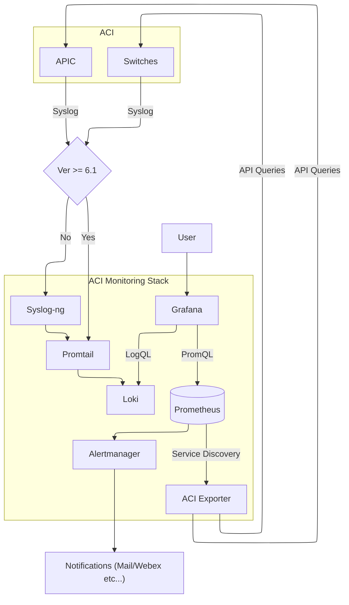
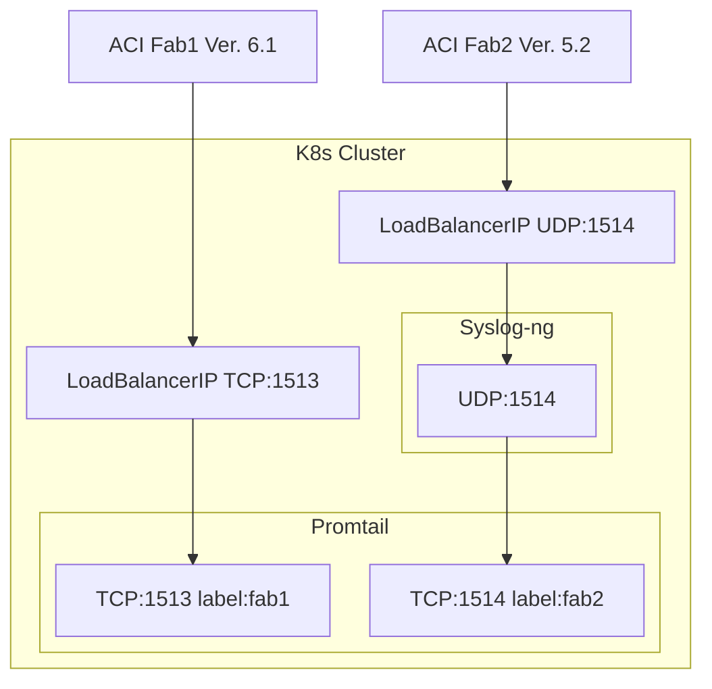

aci-monitoring-stack - Open Source Monitoring for Cisco ACI
------------

# Overview

Harness the power of open source to efficiently monitor your Cisco ACI environment with the ACI-Monitoring-Stack. This lightweight, yet robust, monitoring solution combines top-tier open source tools, each contributing unique capabilities to ensure comprehensive visibility into your ACI infrastructure.

The ACI-Monitoring-Stack integrates the following key components:

- Grafana: The leading open-source analytics and visualization platform. Grafana allows you to create dynamic dashboards that provide real-time insights into your network's performance, health, and metrics. With its user-friendly interface, you can easily visualize and correlate data across your ACI fabric, enabling quicker diagnostics and informed decision-making.

- Prometheus: A powerful open-source monitoring and alerting toolkit. Prometheus excels in collecting and storing metrics in a time-series database, allowing for flexible queries and real-time alerting. Its seamless integration with Grafana ensures that your monitoring stack provides a detailed and up-to-date view of your ACI environment.

- Loki: Designed for efficiently aggregating and querying logs from your entire ACI ecosystem. Loki complements Prometheus by focusing on log aggregation, providing a unified stack for metrics and logs. Its integration with Grafana enables you to correlate log data with metrics and create a holistic monitoring experience.

- Promtail: the agent responsible for gathering and shipping the log files to the Loki server.

- Syslog-ng: is an open-source implementation of the Syslog protocol, its role in this stack is to translate syslog messages from RFC 3164 to 5424. This is needed because Promtail only support Syslog RFC 5424 over TCP and this capability is only available in ACI 6.1 and above.

- ACI-Exporter: A custom-built exporter that serves as the bridge between your Cisco ACI environment and the Prometheus monitoring ecosystem. The ACI-Exporter translates ACI-specific metrics into a format that Prometheus can ingest, ensuring that all crucial data points are captured and monitored effectively.

- Pre-configured ACI data collections queries, alerts, and dashboards (Work In Progress): The ACI-Monitoring-Stack provides a solid foundation for monitoring an ACI fabric with its pre-defined queries, dashboards, and alerts. While these tools are crafted based on best practices to offer immediate insights into network performance, they are not exhaustive. The strength of the ACI-Monitoring-Stack lies in its community-driven approach. Users are invited to contribute their expertise by providing feedback, sharing custom solutions, and helping enhance the stack. Your input helps to refine and expand the stack's capabilities, ensuring it remains a relevant and powerful tool for network monitoring.

# Your Stack

Here you can see a high level diagram of the components used and how they interact together  


# Stack Deployment

## Pre Requisites
- Familiarity with Kubernetes: This installation guide is intended to assist with the setup of the ACI Monitoring stack and assumes prior familiarity with Kubernetes; it is not designed to provide instruction on Kubernetes itself.
- A Kubernetes Cluster: Currently the stack has been tested on `Upstream Kubernetes 1.30.x` and `Minikube`.
  - Persistent Volumes: 10G should be plenty for a small/demo environment. Many Storage provisioner support Volume expansion so should be easy to increase this post installation.
  - Ability to expose services for:
      - Access to the Grafana/Prometheus and Alert Manager dashboards: This will be ideally achieved via an `Ingress Controller`
        - (Optional) Wildcard DNS Entries for the ingress controller domain.
      - Syslog ingestion from ACI: Since the syslog can be sent via `UDP` or `TCP` it is more flexible to use expose these service directly via either a `NodePort` or a `LoadBalancer` service Type
  - Cluster Compute Resources: This stack has been tested against a 500 node ACI fabric and was consuming roughly 8GB of RAM, CPU resources didn't seem to play a major role and any modern CPU should suffice.
  - 1 Dedicated Namespace per instance: One Instance can monitor at least 500 switches.
    - This is not strictly required but is suggested to keep the HELM configuration simple so the default K8s service names can be re-used see the [Config Preparation](#config-preparation) section for more details.

- Helm: This stack is distributed as a helm chart and relies on 3rd party helm charts as well
- Connectivity from your Kubernetes Cluster to ACI either over Out Of Band or In Band

# Installation

If you are installing on Minikube please follow the [Minikube Preparation Steps](docs/minikube.md) and then **come back here.**

## Config Preparation

The ACI Monitoring Stack is a combination of several [Charts](charts), if you are familiar with Helm you are aware of the struggle to propagate dynamic values to sub-charts. For example it is not possible to pass to a sub-chart the name of a service in a dynamic way. 

In order to simplify the user experience the `chart` comes with a few pre-configured parameters that are populated in the configurations of the various sub-charts. 

For example the ACI Exporter Service Name is pre configured as `aci-exporter-svc` and this value is then passed to Prometheus as service Discovery URL.

All these values can be customized and if you need to you can refer to the [Values](values.yaml) file.

*Note:* This is the first HELM char `camrossi` created and he is sure it can be improved. If you have suggestions they are extremely welcome! :) 

### ACI Exporter

ACI Exporter is the bridge between your Cisco ACI environment and the Prometheus monitoring ecosystem, for it to works it needs to know:
- `fabrics`: A list of fabrics and how to connect to the APICs.
  - Requires a **ReadOnly** **Admin** User
- `service_discovery`: Configure if devices are reachable via Out Of Band (`oobMgmtAddr`) or InBand (`inbMgmtAddr`). 

*Note:* The switches are auto-discovered.

This is done by setting the following Values in Helm:

```yaml
aci_exporter:
  # Profiles for different fabrics
  fabrics:
    fab1:
      username: <username>
      password: <password>
      apic:
        - https://IP1
        - https://IP2
        - https://IP3
      # service_discovery oobMgmtAddr|inbMgmtAddr
      service_discovery: oobMgmtAddr
    fab2:
      username: <username>
      password: <password>
      apic:
        - https://IP1
        - https://IP2
        - https://IP3
      # service_discovery oobMgmtAddr|inbMgmtAddr
      service_discovery: inbMgmtAddr
```
### Prometheus and Alert Manager

Prometheus is installed via its [own Chart](https://github.com/prometheus-community/helm-charts/tree/main/charts/prometheus) the options you need to set are:

- The `ingress` config and the baseURL: These most likely are the same URL which can access p`rometheus and `alertmanager`
- Persistent Volume Capacity
- (Optional) `retentionSize`: this is only needed if you wanna limit the retention by size. Keep in mind that if you run out of disk space Prometheus WILL stop working. 
- (Optional) alertmanager route: these are used to send notifications via Mail/Webex etc... the complete syntax is available [Here](https://prometheus.io/docs/alerting/latest/configuration/#receiver-integration-settings) 
Below an example:
```yaml
prometheus:
  server:
    ingress:
      enabled: true
      ingressClassName: "traefik"
      hosts:
        - aci-exporter-prom.apps.c1.cam.ciscolabs.com
    baseURL: "http://aci-exporter-prom.apps.c1.cam.ciscolabs.com"
    service:
      retentionSize: 5GB
    persistentVolume:
      accessModes: ["ReadWriteOnce"]
      size: 5Gi

  alertmanager:
    baseURL: "http://aci-exporter-alertmanager.apps.c1.cam.ciscolabs.com"
    ingress:
      enabled: true
      ingressClassName: "traefik"
      hosts:
        - host: aci-exporter-alertmanager.apps.c1.cam.ciscolabs.com
          paths:
            - path: /
              pathType: ImplementationSpecific
    config:
      route:
        group_by: ['alertname']
        group_interval: 30s
        repeat_interval: 30s
        group_wait: 30s
        receiver: 'webex'
      receivers:
        - name: webex
          webex_configs:
            - send_resolved: false
              api_url: "https://webexapis.com/v1/messages"
              room_id: "<room_id>"
              http_config:
                authorization:
                  credentials: "<credentials>"
```

If you use Webex here some [config steps](docs/webex.md) for you!
### Grafana

Grafana is installed via its [own Chart](https://github.com/grafana/helm-charts/tree/main/charts/grafana) the main options you need to set are:

- The `ingress` config: External URL which can access Grafana, 
- Persistent Volume Capacity
- (Optional) `adminPassword`: If not set will be auto generated and can be found in the `grafana` secret
- (Optional) `viewers_can_edit`: This allows users with a `view only role` to modify the dashboard and access `Explorer` to execute queries against `Pormetheus` and `Loki`. However the user will not be able to save any changes.
- (Optional) `deploymentStrategy`: if Grafana `Persistent Volume` is of type `ReadWriteOnce` rolling updates will get stuck as the new pod cannot start. Setting `deploymentStrategy.type` to `Recreate` destroy the original pod before starting the new one. 
Below an example:

```yaml
grafana:
  grafana.ini:
    users:
      viewers_can_edit: "True"
  adminPassword: <adminPassword>
  deploymentStrategy:
    type: Recreate
  ingress:
    ingressClassName: "traefik"
    enabled: true
    hosts:
      - aci-exporter-grafana.apps.c1.cam.ciscolabs.com
  persistence:
    enabled: true
    size: 2Gi
```
### Syslog config

The syslog config is the most complicated part as it relies on 3 components (`promtail`, `loki` and `syslog-ng`) with their own individual configs. Furthermore there are two issues we need to overcome:

- The Syslog messages don't contain the ACI Fabric name: to be able to distinguish the messaged from one fabric to another the only solution is to use dedicated `external services` with unique IP:Port pair per fabric.
- Until ACI 6.1 we need `syslog-ng` between `ACI` and `Promtail` to convert from RFC 3164 to 5424
  *Note*: Promtail 3.1.0 adds support for RFC 3164 however this **DOES NOT** work for Cisco Switches and still requires syslog-ng. syslog-ng `syslog-parser` has extensive logic to handle all the complexities (and inconsistencies) of RFC 3164 messages.

#### Loki

Loki is deployed with the [Simple Scalable](https://grafana.com/docs/loki/latest/get-started/deployment-modes/#simple-scalable) Profile and is composed of a `backend`, `read` and `write` deployment with a replica of 3.

For the `backend` and `write` volumes it is required to allocation persistent volumes and each deployment will have a dedicated PVC resulting in a total of 6 PVC:
- `3 x data-loki-backend-X`
- `3 x data-loki-write-X`

The default configuration will deploy `2Gi` volumes but this can be easily changed if required check the `loki` section in the [Values](values.yaml) file. if needed.

Loki also requires an `Object Store` and the chart is pre-configured to deploy [minio](https://min.io/).*Note:* Currently [Loki Chart](https://github.com/grafana/loki/tree/main/production/helm/loki) is deploying a very old version of `Minio` and there is a [PR open](https://github.com/grafana/loki/pull/11409) to address this already.

Assuming the default parameters are acceptable the only required config for loki is to set the `rulerConfig.external_url` to point to the Grafana `ingress` URL

```yaml

loki: 
  loki:
    rulerConfig:
      external_url: http://aci-exporter-grafana.apps.c1.cam.ciscolabs.com
```

### Promtail and Syslog-ng

These two components are tightly coupled together and will be explained together.

Promtail is the layer ingesting the logs in RFC5424 format and sends them to Loki. 
Syslog-ng is the layer that translates the logs from RFC 3164 to RFC5424 and sends them to Promtail. 

Promtail is pre-configured with:

- Deployment Mode with 1 replica
- Loki Push Gateway url: `loki-gateway` This is the Loki Gateway K8s service name. 
- Auto generated `scrapeConfigs` that will map a Fabric to a `IP:Port` Pair. 

These setting can be easily changed if required check the `Promtail` section in the [Values](values.yaml) file for more details.

Syslog-ng is pre-configured with:
- Deployment Mode with 1 replica

If you are happy with my defaults the only configs required are setting the `extraPorts` for Loki and `services` for Syslog-ng. You will need one entry per fabric. `Syslog-ng` is only needed for ACI < 6.1

Below a diagram of what is our goal for an ACI 6.1 fabric and an ACI 5.2 one.


The above architecture can be achieved with the following config:

- `name`: This will set the `fabric` labels for the logs received by Loki
- `containerPort`: The port the container listen to. This is mapping a logs stream to a fabric
- `service.type`: I would suggest to set this to either `NodePort` or `LoadBalancer`. Regardless this IP allocated MUST be reachable by all the Fabric Nodes. 
- `service.port`: The port the `LoadBalancer` service is listening to, this will be the port you set into the ACI Syslog config.
- `service.nodePort`: The port the `NodePort` service is listening to, this will be the port you set into the ACI Syslog config.

```yaml
promtail:
  extraPorts:
    fab1:
      name: fab1
      containerPort: 1513
      service:
        type: LoadBalancer
        port: 1513
    fab2:
      name: fab2
      containerPort: 1516
      service:
        type: ClusterIP

syslog:
  services:
    fab2:
        name: fab2
        containerPort: 1516
        protocol: UDP
        service:
          type: LoadBalancer
          port: 1516
```

### ACI Syslog Config
If you need a reminder on how to configure ACI Syslog take a look [Here](docs/syslog.md)

Here an [Example Config for 4 Fabrics](4-fabric-example.yaml)

## Chart Deployment

- Create a file containing all your configs i.e.: `aci-mon-stack-config.yaml`

```shell
helm repo add aci-monitoring-stack https://datacenter.github.io/aci-monitoring-stack
helm repo update
helm -n aci-mon-stack upgrade --install aci-monitoring-stack aci-monitoring-stack -f aci-mon-stack-config.yaml
```