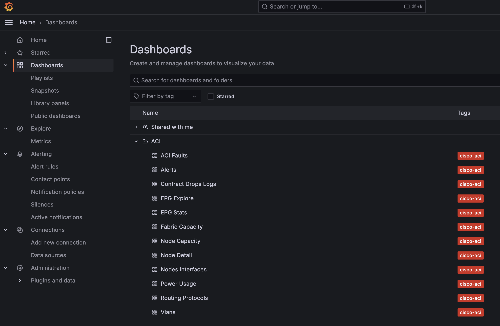
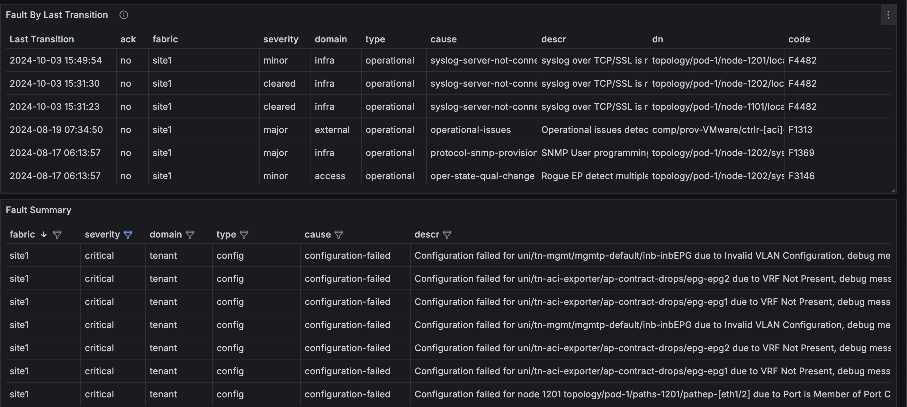

# Access 

The Demo environment is hosted in a DMZ and ca be accessed with the following credentials:

https://64.104.255.11/

user: `guest`
password: `guest`

The guest user is able to modify the dashboards and run `Explore` queries however it can't save any of the configuration changes. 

# Exploring the ACI Monitoring Stack

In this section I am gonna guide you trough the available dashboards and how to use them.

*Note:* Grafana support building dashboard with data coming from Multiple data source but for the moment, the ACI Monitoring stack does not make use of such capability. 

All the Dashboards are located in the `ACI` Folder in the `Dashboards` section of the UI:

## Prometheus backed Dashboards

These dashboards are using `Prometheus` as data source meaning the data we are visualizing came from an ACI Managed Object and was translated by the `aci-exporter`

### ACI Faults
This dashboard is a 1:1 copy of the faults that are present inside ACI. The main advantages copmpared to looking at the faults in the ACI UI are:
-  the ability to aggregating Faults from Multiple Fabrics in a single table
-  allowing advanced sorting and filtering

  

By using the `Fabric` drop down menu you can select different Fabrics (or All) and you can use the Colum headers to filter/sort the data:

This is a good dashboard to understand how Grafana dashboards are built, if you are interested on building your own dashboard you can take a look [here](labs/lab1.md).

### EPG Explore
### EPG  Stats
### Fabric Capacity
### Node Capacity
### Node Details
### Nodes Interfaces
### Power Usage
### Routing Protocols
### Vlans

## Loki backed Dashboards

### Contract Drops Logs

These dashboards are using `Loki` as data source meaning the data we are visualizing came from an ACI Syslog Message

