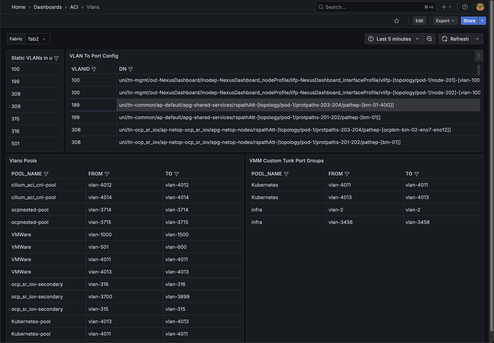

# Access 

The Demo environment is hosted in a DMZ and ca be accessed with the following credentials:

https://64.104.255.11/

user: `guest`
password: `guest`

The guest user is able to modify the dashboards and run `Explore` queries however it can't save any of the configuration changes. 

# Exploring the ACI Monitoring Stack

In this section I am going to guide you trough the available already built dashboards and how to use them. We will cover two types of dashboards based on data provided by Prometheus for fault and alerts data and Loki for syslog data. 

*Note:* Grafana support building dashboard with data coming from Multiple data source but for the moment, the ACI Monitoring stack does not make use of such capability. 

All the Dashboards are located in the `ACI` Folder in the `Dashboards` section of the UI:

The stack is pre-provisioned with the following Dashboards. Feel free to explore the ones that are of interest.
<!-- no toc -->
- [Prometheus backed Dashboards](#prometheus-backed-dashboards)
  - [ACI Faults](#aci-faults)
  - [EPG Explore](#epg-explore)
  - [EPG Stats](#epg-stats)
  - [Fabric Capacity](#fabric-capacity)
  - [Node Capacity](#node-capacity)
  - [Node Details](#node-details)
  - [Nodes Interfaces](#nodes-interfaces)
  - [Power Usage](#power-usage)
  - [Routing Protocols](#routing-protocols)
- [Loki backed Dashboards](#loki-backed-dashboards)
  - [Contract Drops Logs](#contract-drops-logs)
- [Config Export Dashboards](#config-export-dashboards)
  - [Contract Explorer](#contract-explorer)
  - [Fabric Policies - Port Group](#fabric-policies-port-group)
  - [Missing Targets](#missing-targets)
  - [Vlans](#vlans)

## Prometheus backed Dashboards

These dashboards are using `Prometheus` as data source meaning the data we are visualizing came from an ACI Managed Object and was translated by the `aci-exporter`

### ACI Faults
This dashboard is a 1:1 copy of the faults that are present inside ACI. The main advantages compared to looking at the faults in the ACI UI are:
-  the ability to aggregating Faults from Multiple Fabrics in a single table
-  allowing advanced sorting and filtering

  

By using the `Fabric` drop down menu you can select different Fabrics (or All) and you can use the Colum headers to filter/sort the data:

This is a good dashboard to understand how Grafana dashboards are built, if you are interested on building your own dashboard you can take a look [here](labs/lab1.md).

### EPG Explore

The EPG Explore is composed of 2 tables: 
- EPG To Interface - VLANs: This table allows the user to map a EPG to a VLAN port on a switch. This table can be filtered by:
  - fabric
  - tenant
  - epg
- V(x)LANs to EPG - Interface: This table allows the user to map a VLAN to an EPG and a port on a switch. This table can be filtered by:
  - VLAN
  - VXLAN

*Limitations:* This has not yet been tested with overlapping VLANs

### EPG Stats

This dashboard contains the following time series graphs:

- EPG RX Gbits/s: This show the Received traffic in the EPG
- EPG TX Gbits/s: This show the Transmitted traffic by the EPG
- EPG Drops RX Pkts/s: This show the number of Packet drops in the ingress direction
- EPG Drops TX Pkts/s: This show the number of Packet drops in the egress direction

These dashboards are built with the same logic as the ACI EPG Stats dashboards, just in Grafana

### Fabric Capacity

This dashboard contains the same info as the APIC Fabric Capacity dashboard but allows to plot the resource usage over a time period to better monitor the fabric utilization over time

### Node Capacity

This dashboard contains the same info as the APIC FabrNodeic Capacity dashboard but allows to plot the resource usage over a time period to better monitor the fabric utilization over time

### Node Details

This dashboard contains the following time series graphs:

- Node CPU Usage
- Node Memory Usage
- Node Health

### Nodes Interfaces

This dashboard contains the following graphs:

- Node Interface status: This dashboard shows which interface are Up/Down
- Interface RX/TX Usage: This dashboard shows the interface utilization in %, it is sorted by highest usage and will display the top 10 interfaces by usage.

### Power Usage

This dashboard display a time series graph of the average power draw per switch

### Routing Protocols

This dashboard contains the following graphs:

- L3 Neighbours: For every BGP or OSPF neighbors we display the Node to Peer IP peering, the routing protocol used the State of the connect etc...
- BGP Advertised/Received Paths: For every BGP peering we display the number of paths received/advertised
- BGP Accepted Paths: Time series graph of **received** BGP prefixes

## Loki backed Dashboards

These dashboards are using `Loki` as data source meaning the data we are visualizing came from an ACI Syslog Message

### Contract Drops Logs

This dashboard parses the logs received by the switches and extract infos on the Contract Drop Logs. This requires a specific [config](syslog.md) on ACI and is limited to 500 Messages/s per switch

## Config Export Dashboards
These dashboard are based on data extracted from ACI Config Snapshot and converted in a Graph Database.

### Contract Explorer

This dashboard allows the user to select a contract and will display how a contract is deployed and what EPG/ESGs are providing or consuming it.

### Fabric Policies - Port Group

This dashboard displays detailed information about a port group allowing the user to understand the mappings of:

- VLANs
- Domains
- AAEP
- Leaves and ports 

### Missing Targets

Detects and Show missing targets. This is still a bit of a work in progress and should be improved a bit!

### Vlans

Display the APIC config for VLAN Pools and VMM Custom Trunk Ports in filterable tables. 

[Next - Lab1](labs/lab1.md)