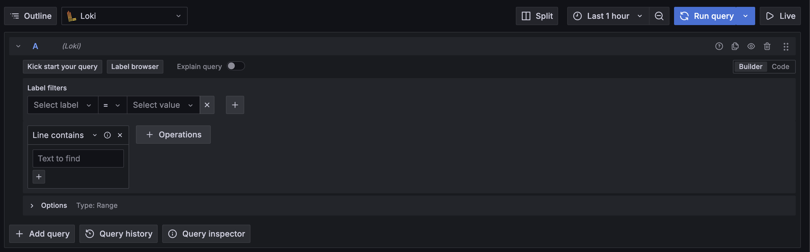
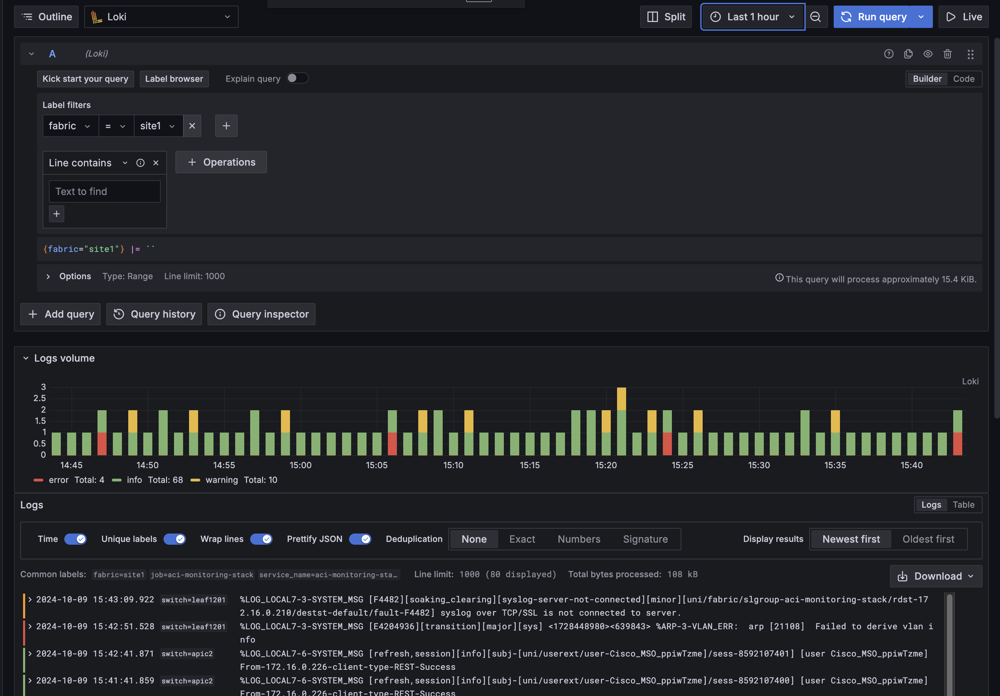
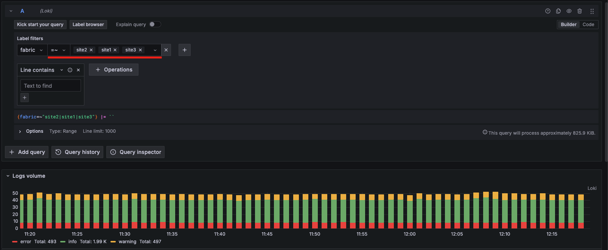
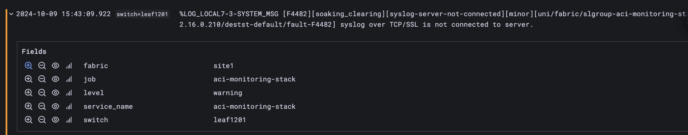
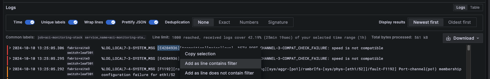
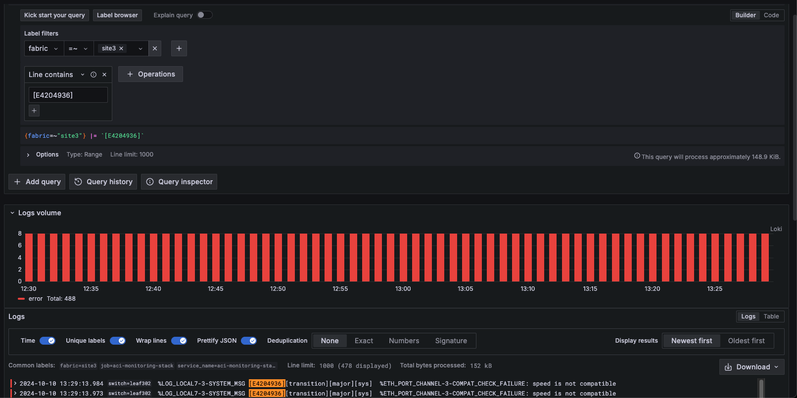

# Overview 

In this lab we are going to use `Explore` to visualize the Logs Received by our ACI fabrics. 

**This labs assumes you are familiar with the [Demo Environment](../demo-environment.md)**

# Access 

The Demo environment is hosted in a DMZ and ca be accessed with the following credentials:

https://64.104.255.11/

user: `guest`
password: `guest`

The guest user is able to modify the dashboards and run `Explore` queries however it can't save any of the configuration changes. 

# Log Filtering and Exploring

This lab will follow a free form where I will show you how to select logs from a fabric and how to filter them. Feel free to play around as well this is a great way to get a bit more familiar. 

## Access Explore

You can find `Explore` in the left panel of the Grafana UI.

By default `Explore` will select `Prometheus` as data source as you can see in the pic above. Let's switch to `Loki` by clicking on `Prometheus` and Selecting `Loki`

 

Now the UI should change and show the `Loki Builder`

As we saw previously in [lab1](lab1.md) with `Prometheus` we can use Labels to filter/visualize logs. Loki uses labels as well as regular expression to filter trough our logs. 

## Grab Some Logs!

To display the logs from a fabric you need to select a Label and a Value:
Go to Label Filters and select the following from the dropdowns:

- *Select Label*: `fabric`
- *Select value*: `site2`
  
This tells Grafana to pull in the logs where the fabric name is `site2` 

**Note:** In this example we are focusing on Grafana Dashboard, *someone* configured ACI to send the logs to Loki.  You can check out the [deployment](../deployment.md#syslog-config) guide if you would like to know more.

Press "Run Query" and you should be presented with something similar to the picture below:

As you can see above, the logs are already color coded by severity allowing to easily understand if we should take a deeper look into our fabrics.
It is also possible to load all the logs from multiple fabrics, just click on the `=` and select `=~` now you can pick all 3 sites and if you re-run the query Grafana will load all the logs:

If you expand a Log entry you will see the logs message details and its labels. As you can see there are just a handful of labels.

In Loki it is better to keep labels to a minimum and to use filter expressions `(|= "text", |~ "regex", …)` and brute force the logs. This is in line with [Loki Label best practices](https://grafana.com/docs/loki/latest/get-started/labels/bp-labels/).

## Logs Filtering

Log filtering can be done manually by entering a `RegEx` or you can highlight a part of a log message and add the text as included or excluded. 

For example if we want to show only messages where the error code is `[E4204936]` you can manually enter that text in the `Line Contains` box or you can simply highlight the text with your mouse and select *Add as line contains filter*

The result will be something similar to what you can see below, feel free to use different filters, these screenshot are just examples!

# The End
This concludes Lab2, feel free to play around more with this dashboard if you want or you can proceed to [DMZ Deployment](dmz-deploy.md) instructions