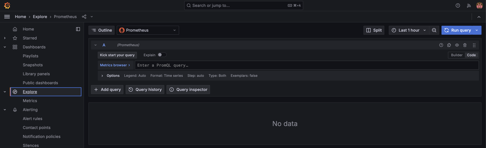

# Overview 

All the dashboards that are tagged as `cisco-aci-config` are generated by creating a backup of the ACI confing and importint it into a graph database.

A graph database is a type of database designed to represent and store data as a network of interconnected nodes (entities) and edges (relationships). Unlike traditional relational databases that use tables, graph databases use graph structures to model relationships between data, making them highly efficient for querying and analyzing complex, interconnected data. Each node represents an entity (e.g., a person, product, or location), while edges define relationships (e.g., "friend of," "purchased," or "located at").

This works great to represent the ACI Configuration and allows us to create custom dashboards by using the `Cypher` language. 

Cypher is a query language specifically designed for working with graph databases. It is declarative, meaning you describe what you want to retrieve or manipulate in the graph, and the database engine determines the best way to execute the query. Cypher is similar in concept to SQL for relational databases but is optimized for graph structures, enabling intuitive and powerful querying of nodes (entities), relationships (edges), and their properties.

Cypher uses a pattern-matching syntax that resembles ASCII art, making it easy to visualize and query graphs. For example, (a)-[r]->(b) represents a node a connected to node b by a relationship r. You can use Cypher to perform a variety of graph operations, such as finding shortest paths, traversing relationships, filtering based on properties, and creating or modifying nodes and edges.

Feel free to explore the pre-existing dashboard once you are done if you want to experiment head over to:

You can find `Explore` in the left panel of the Grafana UI and from the Drop Down Select `memgraph`


Now let's try writing a simple query:

```sql
MATCH (t:fvTenant)-[r]-(vrf:fvCtx) 
WHERE t.fabric="site3"
return *
```

This will return a mapping of Tenants to VRF. Try now to take a look at the `Contract Explorer` dashboard and edit it. You will see that the cypher query is a bit more complex:

```sql
MATCH (provider)-[r1:fvRsProv|vzRsAnyToProv]-(contract:vzBrCP)-[r2:fvRsCons|vzRsAnyToCons]-(consumer)
WHERE  contract.dn="uni/tn-$tenant/brc-$contract" and contract.fabric='$fabric'

RETURN provider.dn as ProviderDN, consumer.dn as ConsumerDN
```

1. MATCH: The query is looking for a specific structure (or pattern) in the graph.
2. Nodes:
    - (provider): A node representing the provider (this could be any entity or object, depending on the graph's context). I do like this as this can be a EPG/ESG or a VRF
    - (contract:vzBrCP): A node representing a contract, specifically an ACI Class of type vzBrCP 
    -  (consumer): A node representing the consumer (another entity or object). I do like this as this can be a EPG/ESG or a VRF
3. Relationships:
   - [r1:fvRsProv|vzRsAnyToProv]: There is a relationship between the `provider` and the `contract`, which can be of type fvRsProv or vzRsAnyToProv.
   - [r2:fvRsCons|vzRsAnyToCons]: There is a relationship between the `contract` and the `consumer`, which can be of type fvRsCons or vzRsAnyToCons.
4. Pattern:
    - The query is looking for a provider node that is connected to a contract node via one of the specified relationships (fvRsProv or vzRsAnyToProv).
    - Then, it looks for a consumer node that is also connected to the same contract node via one of the specified relationships (fvRsCons or vzRsAnyToCons).

5. WHERE: It simply filter the result by fabric and contract name that you can select from the grafana dashboard.
6. RETURN: Instead of returning everything we return only the Distinguisher names of the ACI Objects. 

If you want to challenge yourself you can take a look at the `Fabric Policies - Port Group` dashboard query.